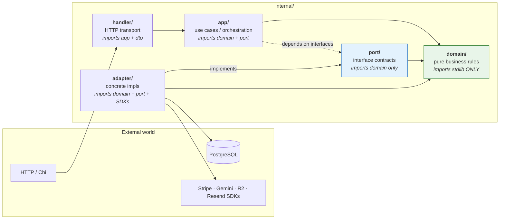
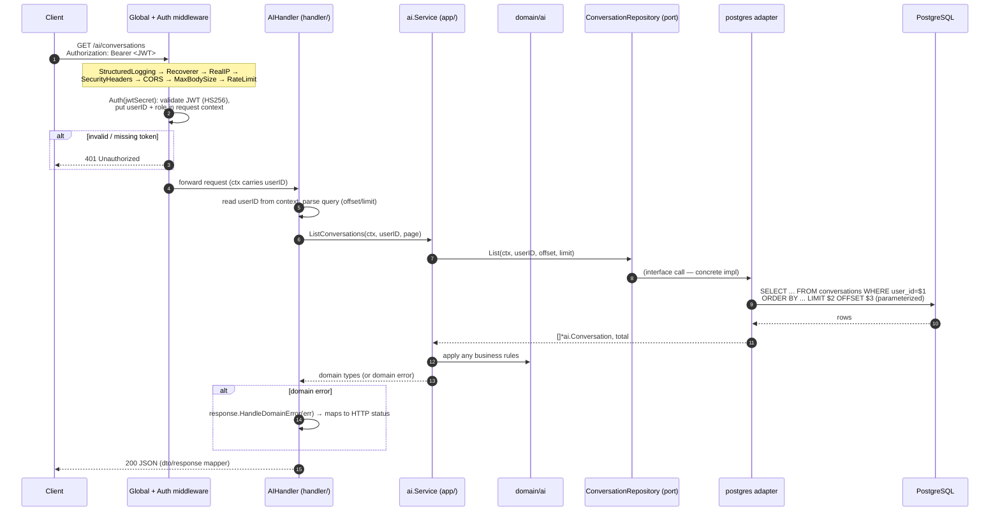
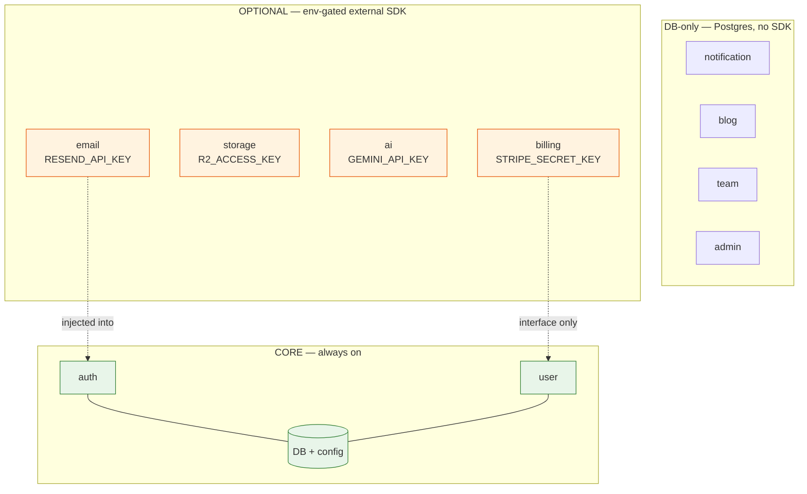
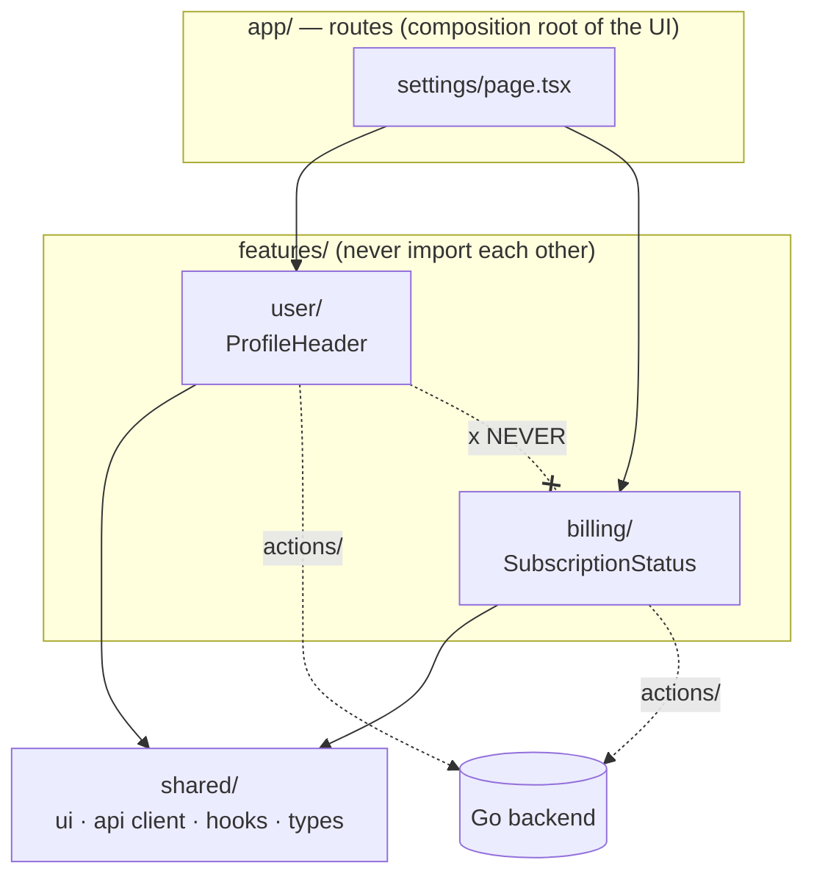
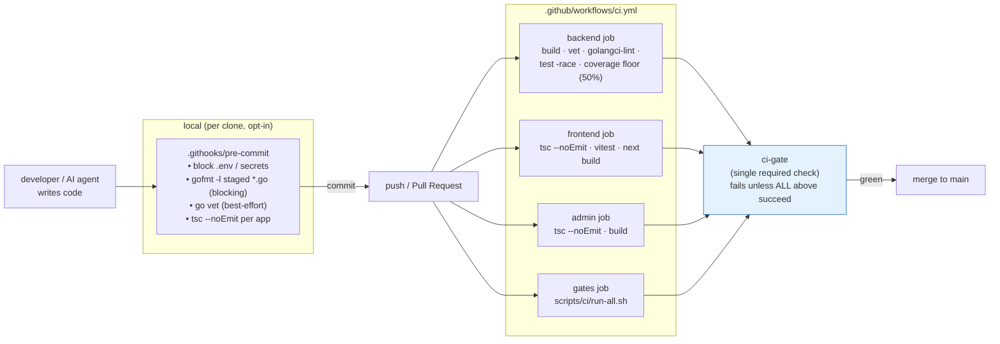

# CleanSaaS Architecture

> **If you read one doc, read this one.** It is the canonical map of how CleanSaaS
> is built and why. Every claim here is grounded in the actual tree
> (`backend/cmd/api/main.go`, `backend/internal/handler/router.go`,
> `backend/internal/`, `backend/migrations/`, `scripts/ci/`, `.github/workflows/`).
> Where something is **not yet built**, it is called out as **roadmap** — this doc
> does not overclaim.

**Stack:** Next.js 16 (frontend) · Go 1.25 + Chi v5 (backend) · PostgreSQL 16 (pure SQL, no ORM)
**Infra (prod):** Vercel · Railway · Neon · Cloudflare R2

---

## 1. Overview & philosophy

CleanSaaS is an **open-source boilerplate for medium-to-large SaaS apps** — not a
micro-SaaS starter. It ships with auth, billing, AI chat, storage, notifications,
teams, blog, and an admin panel, and is designed so a future `create-cleansaas` CLI
can let users keep only the modules they want.

Two ideas drive every decision.

### a. Modularity above all — core vs. optional

We don't know what the end user will build. So **every feature must be fully independent and removable**:

- Deleting a feature's folder (frontend + backend) + its lines in `cmd/api/main.go` causes **zero compilation errors** elsewhere.
- No feature imports another feature directly. Cross-feature needs are satisfied through **interfaces injected at the composition root**.
- A feature's tables can be dropped without breaking other tables (**no cross-feature foreign keys**).

**The only hard core — everything depends on these:**

- **Auth** (users must exist for anything to work)
- **Database connection + config**

Everything else — billing, AI, storage, email, notifications, blog, team, admin —
is optional. A user might want billing but not AI, or vice-versa. Both must work.

### b. The enforcement-system thesis

This boilerplate is built to be extended largely by **AI agents**, and AI-generated
code rots fast unless something forces it to stay clean. CleanSaaS treats
maintainability as a **system**, not a hope:

| Layer | What it forces | Where |
|-------|----------------|-------|
| **`CLAUDE.md` (×4)** | Conventions, dependency rule, code limits, modularity rules | repo root + `backend/` + `frontend/` + `admin/` |
| **`.claude/memory/`** | Durable architecture notes that survive context compaction | `.claude/memory/architecture.md` |
| **`.claude/skills/`** | Codified workflows so agents follow the *same* steps every time | `/add-feature`, `/remove-feature`, `/verify-independence`, … |
| **Pre-commit hook** | Blocks secrets + unformatted Go + TS type errors before they land | `.githooks/pre-commit` |
| **CI** | Build · vet · lint · race-tested · coverage floor · invariant gates | `.github/workflows/ci.yml` |
| **Invariant gates** | Mechanically reject cross-feature imports, hardcoded colors, oversized files, forbidden names, unpaired migrations | `scripts/ci/` |

The point: a human reviewer can be tired, but `scripts/ci/check-cross-feature-imports.sh`
never is. The rules in the CLAUDE.md files are not trusted — they are **checked**.

**Hard code-quality limits (CI-enforced):** ≤ 600 lines/file · ≤ 50 lines/function ·
≤ 4 params/function · ≤ 3 nesting levels · cyclomatic complexity < 10 · no
indescriptive names (`data`, `util`, `manager`, `helper`, `doStuff`, …).

---

## 2. Hexagonal layers (backend)

The backend is a **hexagonal / ports-and-adapters** architecture. The dependency
rule is absolute and never broken:

```
handler → app → domain ← port ← adapter
```



**Direction of dependencies always points inward toward `domain/`.** Adapters and
handlers are the only layers that know the outside world exists; the domain knows nothing.

### What each layer may import

| Layer | May import | Must NOT import | Contains |
|-------|-----------|-----------------|----------|
| **`domain/`** | Go stdlib only | anything else | entities (`user`, `billing`, `ai`, `team`, …), value objects, typed errors (`ErrNotFound`, `ErrValidation`, `ErrUnauthorized`). Entities validate themselves. |
| **`port/`** | `domain/` | app, adapter, SDKs | small, focused interfaces. Two sub-packages: `repository/` (persistence) and `service/` (external seams). |
| **`app/`** | `domain/`, `port/` (interfaces) | any `adapter/` | use cases per functional domain (`auth`, `user`, `billing`, `ai`, `storage`, `notification`, `blog`, `team`, `admin`). Constructor-injected ports. Returns domain types/errors — **never** HTTP concepts. |
| **`adapter/`** | `domain/`, `port/`, external SDKs | **another adapter** | concrete impls: `postgres/`, `stripe/`, `gemini/`, `r2/`, `resend/`. Each implements one or more port interfaces. |
| **`handler/`** | `app/`, `dto/` | `domain` business logic, adapters | Chi routes, thin handlers, `middleware/`, `dto/request` + `dto/response`. |
| **`pkg/`** | stdlib + 3rd-party utils | `internal/` | reusable, self-contained: `jwt`, `hash`, `validate`, `pagination`, `jobs`, `ws`. |

> An **adapter never imports another adapter**, and an **app service never imports an
> adapter directly** — only the port interface. This is what makes providers swappable.

### The one-line provider swap

Because `app/` depends on a port interface and the concrete adapter is chosen only in
`cmd/api/main.go`, swapping a provider is one new file + one changed line:

```go
// Replace Stripe with Lemon Squeezy:
// 1. adapter/lemonsqueezy/{client.go,payment.go} — implement service.PaymentService
// 2. in cmd/api/main.go, change ONE line:
paymentSvc := adaptstripe.NewPaymentService(cfg.StripeKey, cfg.StripeWebhookSecret)
//          → lemonsqueezy.NewPaymentService(...)
// Nothing in app/, domain/, or handler/ changes.
```

Current adapters and the ports they satisfy:

| Adapter | Implements (port) | Notes |
|---------|-------------------|-------|
| `postgres/` | all `repository.*` interfaces | pure SQL via `database/sql` + `lib/pq` |
| `stripe/` | `service.PaymentService` | |
| `resend/` | `service.EmailService` | |
| `gemini/` | `service.AIService` | **swap point** for any LLM (see §4) |
| `r2/` | `service.StorageService` | Cloudflare R2 via aws-sdk-go-v2 S3 API |

---

## 3. Request flow (authenticated request)

Example: an authenticated user lists their AI conversations
(`GET /ai/conversations`). Routes are mounted at **root** (`/ai/...`, not `/api/...`).



Key points the diagram encodes:

- **JWT auth** happens in middleware; the handler only reads `userID`/`role` from context (`middleware.UserIDFromContext`).
- The handler is **thin**: decode → call app service → map result/error to HTTP.
- The app service speaks **interfaces** (`ConversationRepository`), so it never knows it's PostgreSQL.
- The adapter uses **parameterized SQL** with `context.Context` for timeout/cancellation.
- Domain errors flow back up and are translated to HTTP **only** at the handler boundary via `response.HandleDomainError`.

---

## 4. Module map

Modules after the cleanup of the tree. **Core** is always on. **Optional** modules are
**env-gated** in `cmd/api/main.go` — if the key is absent, the service is `nil` and its
routes are simply not mounted. **DB-only** modules use no external SDK (Postgres only).

> There is **no `referral` module** and **no mobile app** — both were removed.

| Module | Class | Enabling env key | What it does | Backend layers present |
|--------|-------|------------------|--------------|------------------------|
| **auth** | core | — (always) | register, login, password reset, email verification (JWT, bcrypt) | domain, port, app, postgres, handler |
| **user** | core | — (always) | profile, password change, account delete | domain, port, app, postgres, handler |
| **notification** | DB-only | — (always) | list / unread-count / mark-read; pushed over WebSocket | domain, port, app, postgres, handler |
| **blog** | DB-only | — (always) | public posts + admin CMS (managed from admin app) | domain, port, app, postgres, handler |
| **team** | DB-only | gated by `teamSvc != nil` in main.go | teams + members + invites | domain, port, app, postgres, handler |
| **admin** | DB-only | — (gated by `RequireAdmin` role) | dashboard stats, user role mgmt, blog CMS | app (composed over user+blog), handler |
| **billing** | optional | `STRIPE_SECRET_KEY` | plans, checkout, subscription, invoices, portal, webhooks (Stripe) | domain, port, app, **stripe**, postgres, handler |
| **storage** | optional | `R2_ACCESS_KEY` | file upload / list / delete (Cloudflare R2) | domain, port, app, **r2**, postgres, handler |
| **ai** | optional | `GEMINI_API_KEY` | conversations + streaming chat (Gemini) | domain, port, app, **gemini**, postgres, handler |
| **email** | optional | `RESEND_API_KEY` | transactional email (Resend) — injected into auth | port, app-consumed, **resend** |

> **Email is special:** it's not a standalone feature with its own routes — it's a
> `service.EmailService` injected into `auth`. When `RESEND_API_KEY` is unset, `emailSvc`
> is `nil` and auth degrades gracefully (no email sends).



> Several modules also expose **public demo endpoints** (`/demo/ai`, `/demo/billing`,
> `/demo/storage`) for the live showcase — these mount only when the corresponding
> service is enabled, are heavily rate-limited, and don't require auth.

### LLM provider swap (AI)

`ai` talks to `service.AIService`. Today the only adapter is **Gemini**
(`adapter/gemini/`). `config.go` already reads `CLAUDE_API_KEY` and `OPENAI_API_KEY`,
but **no `adapter/claude` or `adapter/openai` exists yet** — adding one is the canonical
"one new file + one line in `main.go`" swap. *(roadmap: ship those adapters)*

---

## 5. Frontend feature architecture

The frontend mirrors the backend's modularity with a **feature-based** layout
(Next.js 16 App Router, Tailwind v4).

```
frontend/src/
├── app/         → ROUTING ONLY (thin pages, 5–20 lines). Composition lives here.
├── features/    → SELF-CONTAINED modules (auth, billing, user, ai, notification,
│                  storage, admin, marketing, blog, team)
├── shared/      → cross-feature reusable: components/ui (shadcn), hooks, lib (api client), types
├── config/      → site config
└── styles/      → globals.css (design tokens as CSS vars)
```

Rules (CI-enforced — see §8):

- **Server Components by default.** A component is a Client Component (`"use client"`)
  only if it needs `useState`/`useEffect`/event handlers (forms, modals, dropdowns, real-time).
- **Features never import each other.** If two features need the same thing, it moves to `shared/`.
  Cross-feature composition happens **only in `app/` pages**.
- Each feature has `components/`, `actions/` (feature-scoped Server Actions that call the Go
  backend), `hooks/`, `types.ts`. Server Actions only call endpoints for *their own* feature.
- **No hardcoded colors** — only semantic design tokens (`bg-primary`, `text-muted-foreground`, …).



---

## 6. Data & migrations

- **Pure SQL, no ORM, no query builder.** `database/sql` + `lib/pq`, parameterized queries
  only (`$1, $2`) — never string concatenation. All queries take a `context.Context`.
- **Migrations** via `golang-migrate` in `backend/migrations/`, numbered with paired
  `NNN_name.up.sql` / `NNN_name.down.sql`. Every `up` must be reversible; `IF [NOT] EXISTS`
  for idempotency. **Immutable once applied in prod** — never edit, only add a new migration.
- **Every table:** UUID PK (`gen_random_uuid()`), `created_at`, `updated_at`. `TEXT` not
  `VARCHAR`. Foreign keys indexed.
- **No cross-feature foreign keys.** The only allowed cross-table reference is
  `REFERENCES users(id)` (the core). Within a single feature, intra-feature FKs are fine
  (e.g. `team_members.team_id REFERENCES teams(id)` — same feature). Example from `004_create_billing.up.sql`:
  `subscriptions.user_id → users(id)`, `subscriptions.plan_id → plans(id)` (both inside billing);
  no table references `subscriptions` from another feature.

Current migration set (after cleanup):

```
001_create_users            005_create_files           010_add_performance_indexes
002_create_password_resets  006_create_conversations   011_create_teams
003_create_email_verifications  007_create_notifications
004_create_billing          008_create_blog
```

> **Pagination — honest note:** the shared `pkg/pagination` helper is **offset/limit
> based** (`?offset=&limit=`, default limit 20, max 100). Keyset/cursor pagination is
> **not implemented** today; it's worth adopting for large, hot tables — **roadmap**.

---

## 7. Cross-cutting infra & scaling (honest)

These live in `pkg/` and are wired in `cmd/api/main.go`. **All three are currently
in-process / single-instance.** They work great for one backend node and for the
boilerplate's default deployment, but they are **not yet horizontally scalable**.

| Concern | Today (in `pkg/`) | State | What multi-instance needs |
|---------|-------------------|-------|----------------------------|
| **Rate limiter** | `handler/middleware/ratelimit.go` — in-memory counters per node | single-instance | Redis-backed shared counter |
| **Job scheduler** | `pkg/jobs` — in-process tickers (cleanup expired tokens, stats logging) | single-instance | distributed lock / external scheduler so jobs don't double-run |
| **WebSocket hub** | `pkg/ws` — in-memory connection registry; broadcasts notifications | single-instance | Redis pub/sub (or similar) fan-out across nodes |

**Honest stance:** the *request path* is stateless (JWT, no server sessions), so the HTTP
API itself scales horizontally. But until the three components above get **Redis-backed
adapters**, running multiple backend nodes will give each node its own rate-limit window,
duplicate scheduled jobs, and split WebSocket audiences. Those Redis adapters are **on the
roadmap**, and the hexagonal design means they slot in behind the existing seams without
touching app/domain code.

Other roadmap items deliberately **not** claimed as done:

- **Refresh tokens** — auth issues short-lived JWTs; no refresh-token rotation yet.
- **Row-Level Security (RLS)** — isolation is enforced in app/queries (`WHERE user_id = $1`), not by Postgres RLS.
- **DDD richness for billing/team** — these are functional but lean; their domains can grow richer over time.

---

## 8. Enforcement — how a change is gated

A change passes through three gates. The first two run locally; CI is the source of truth.



**Invariant gates** (`scripts/ci/run-all.sh` runs each in its own subshell so all
failures are reported, not just the first):

| Gate script | Rejects |
|-------------|---------|
| `check-cross-feature-imports.sh` | a frontend feature importing another feature |
| `check-migration-pairs.sh` | a migration missing its `.up.sql` or `.down.sql` |
| `check-hardcoded-colors.sh` | hardcoded Tailwind colors (`zinc-`, `gray-`, `white`, …) instead of tokens |
| `check-file-length.sh` | files over the 600-line limit |
| `check-forbidden-names.sh` | indescriptive names (`data`, `util`, `manager`, `doStuff`, …) |

The gates have their **own tests** in `scripts/ci/__tests__/` — the enforcement is itself tested.

- **`ci-gate`** is the single status check branch protection should require. It uses
  `if: always()` and turns any skipped/cancelled/failed dependency into a hard failure,
  so you can't merge by having a job silently skipped.
- Pre-commit is **opt-in per clone** (`bash scripts/install-git-hooks.sh` sets
  `core.hooksPath=.githooks`). It's zero-dependency bash and **skips** toolchains that
  aren't installed (commit frontend-only changes without Go, and vice-versa). Bypass a
  single commit with `git commit --no-verify`.

---

## 9. Adding / removing a feature

Use the codified skills — they encode the exact order so the dependency rule and
modularity invariants hold automatically.

| Goal | Skill | Backend order it follows |
|------|-------|--------------------------|
| **Add** a full-stack module | `/add-feature` | domain → domain test → port → app → app test → adapter (postgres + any SDK) → handler → DTOs → **wire in `cmd/api/main.go`** → migration (`up`+`down`) |
| Add an endpoint to an existing feature | `/add-endpoint` | new handler method + app method + test |
| Add / swap an external provider | `/add-adapter` | new `adapter/<name>/` implementing the port + one line in `main.go` |
| Add a table/column | `/add-migration` | paired `up`/`down`, no cross-feature FK |
| **Remove** a module cleanly | `/remove-feature` | delete feature folders (backend + frontend) + its lines in `main.go` + revert/skip its migrations |
| **Prove** a module is removable (no mutation) | `/verify-independence` | dry-run check that deletion leaves the build green |
| Verify all architecture rules | `/check` | runs the invariant gates |

**The litmus test for any new feature:** *"If I delete this feature's entire folder and
its lines in `cmd/api/main.go`, does everything else still compile and run?"* If the
answer is no, there is a hidden dependency to fix — `/verify-independence` exists to
answer that question mechanically before you merge.
